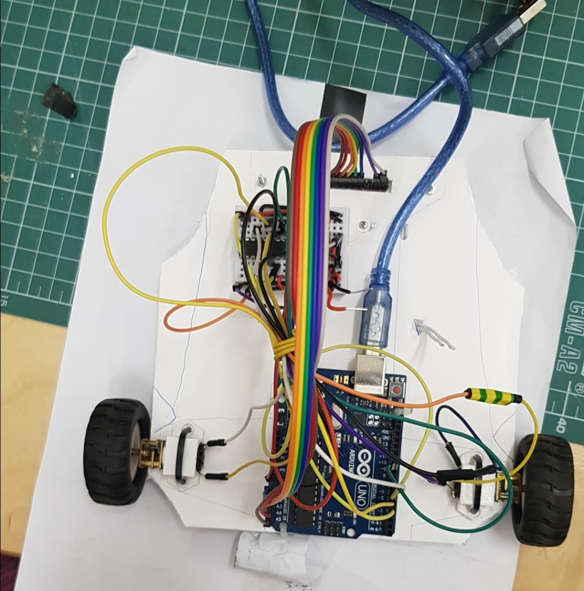
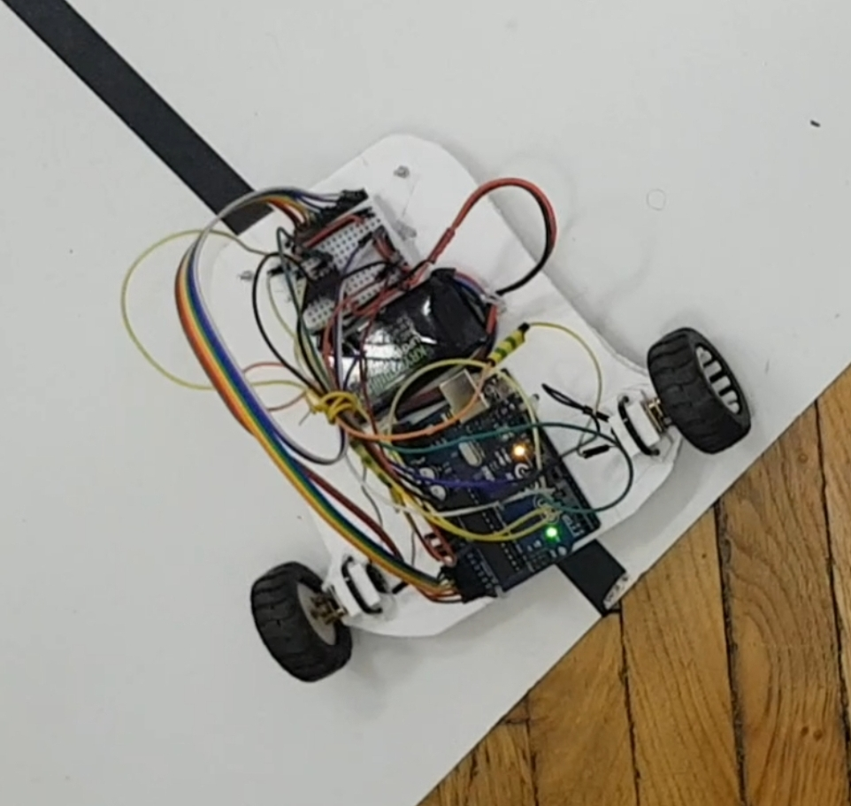

# PID-Line-Follower
This repo contains the code and the documentation for a line follower that was the final project for my "Introduction to Robotics" course at the University of Bucharest. 

This was developed in a team made up of Moraru Ilinca (https://github.com/ilinca-ana-moraru) Anghel Ioan (https://github.com/ioananghel) and myself (https://github.com/mircea-mihail).

The task for the project was to develop a line follower that would complete a course designed by the professors in as little time as possible. We had the final track on hand during development so tweaking the design to optimise maximum performance on it was nice. Check out the final version of the project performing for our grade on youtube: https://youtube.com/watch?v=Q4rl68Txs_0 (we got a 10). 

The Design

The design of the robot was made using the initial plastic chassis from it's kit as a stencil. We cut out a new one from Styrofoam and used it to attach the components in the same way as the original.

The weight distribution was made as even as possible, with the arduino at the back of the car, between the wheels, the LiPo battery in the middle and the small breadboard was placed on top of the ball caster, before the reflectance sensors.

The motors were attached to the body using 3D printed brackets that were also provided to us.

The Code

I'd like to go into detail a bit about the code behind this project. There are several key aspects that made everything work as well as it did that are worth talking about. 

First of all, the derivative. Initially it was currentError - lastError, which, although good in theory, in practice it was between -1 and 1, and we had it as an integer. Now that i think about it, maybe making it a float would have been a better idea, but we ended up with making it currentError - tenErrorsAgo which gave us more wiggle room (more scale factors) for the derivative (I think it was between -20 and 20 most of the time)

Second of all, the motors going in reverse. When making a sharp turn you want one wheel to turn a lot and the other not turn, or turn in reverse. We had to find a sweet spot for the wheel turning in reverse and ended up making it minimum -220, with the one going forward as maximum 255.

Also, another thing that shaved a few seconds of the final time was a function that adjusted the speed of the car depending on the derivative. Looking back, we should have had the function kick in not from 0 to 10, but from something like 4 or 5 to 10, so that the car would keep top speed on wide curves.

The integrative is just a sliding window keeping track of 50 errors, with an index keeping track of the current error insertion place.

Components

  <ul>
    <li>Arduino Board</li>
    <li>2x DC Motors</li>
    <li>2x Wheels</li>
    <li>Ball Caster</li>
    <li>Breadboard</li>
    <li>LiPo Battery</li>
    <li>Reflectance Sensor</li>
    <li>Zip Ties</li>
    <li>L293D Motor Driver</li>
    <li>Jumper Wires</li>
    <li>Styrofoam Board</li> 
  </ul>

At the end of the project, we managed to get the robot to complete the course in 15.081 seconds. This run can also be seen in the video showcasing the functionality.

